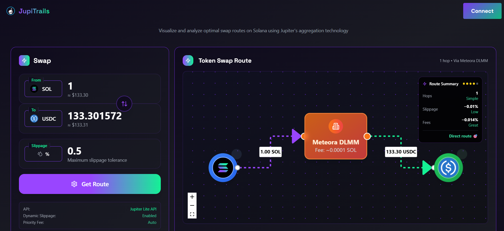
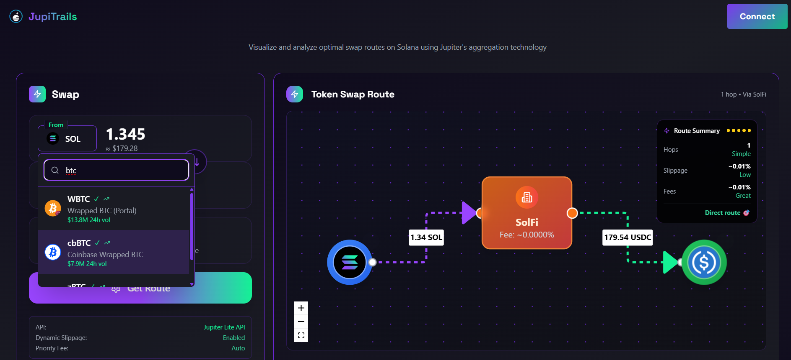
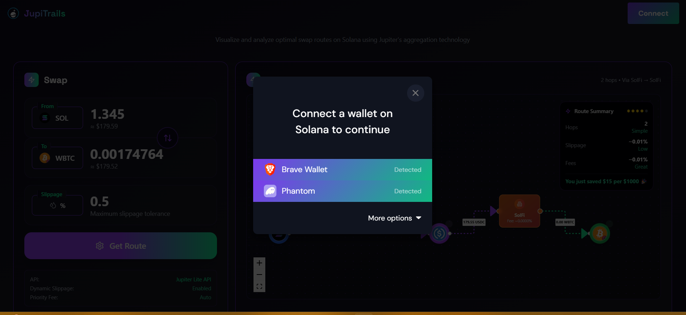
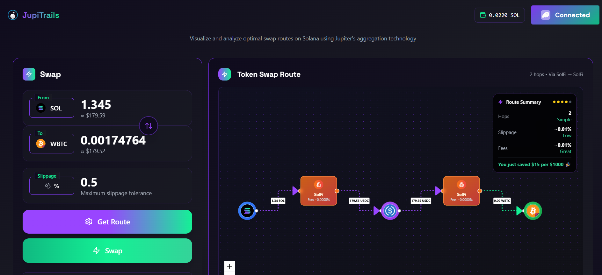
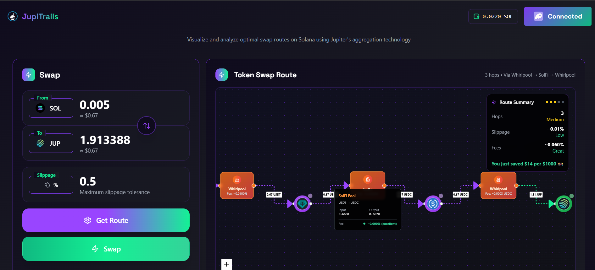
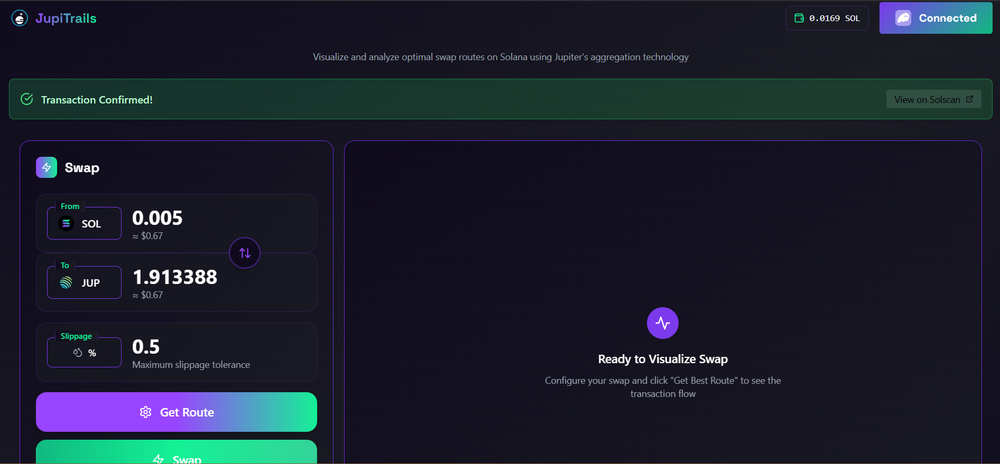
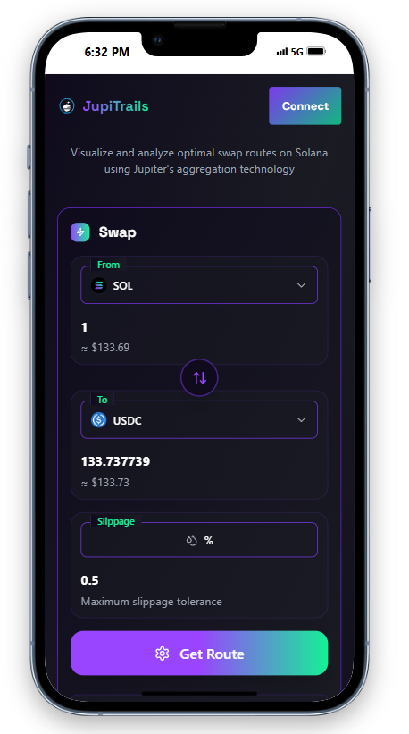

# JupiTrails 🚀

<div align="center">
  
  <h3>Visualize and analyze optimal swap routes on Solana using Jupiter's aggregation technology</h3>
  
  <p>
    <strong>React</strong> • <strong>TypeScript</strong> • <strong>Tailwind CSS</strong> • <strong>Solana Web3.js</strong> • <strong>Jupiter API</strong>
  </p>
</div>

## 📝 Project Description

JupiTrails is a visual and interactive interface that enhances user interaction with the Jupiter Aggregator API on Solana. It simplifies and enriches the token swap experience by offering a visualized trail of swap routes, enabling users to make more informed decisions during DeFi transactions.

Unlike typical Jupiter integrations that only show the best route output, **JupiTrails displays all route possibilities**, giving users full transparency and control over their swap decisions. The application focuses on clarity, control, and performance — designed to be developer-friendly and intuitive for traders at all levels.

## 📸 Platform Screenshots

<div align="center">

### Main Interface with Dynamic Route Visualization



### Tokens with Genuine Trusted Tick and Trend Indicators



### Wallet Integration



### Swap Option with Real-Time Wallet Balance



### Live Interactive Route Visualization with Risk Assessment and Savings



### Transaction Confirmation with Solscan Explorer Integration



### Fully Responsive Design for Mobile Devices



</div>

### 🎯 What Makes JupiTrails Special

JupiTrails transforms Jupiter's powerful aggregation technology into an accessible, visual experience with unique features:

- **Route Transparency**: See exactly how your swap travels through different AMMs and liquidity sources with interactive visualizations
- **Real-time Intelligence**: Automatic route optimization and price updates without manual intervention
- **Liquidity Intelligence**: Display 24h trading volume, liquidity indicators, and trending tokens with volume badges
- **Token Verification System**: Visual verification badges and trust indicators for tokens
- **Advanced UI/UX**: Modern floating labels, responsive design, and Jupiter-themed gradients with shimmer effects
- **Smart Input Handling**: Intelligent decimal validation, auto-formatting, and real-time USD pricing
- **Educational Value**: Learn about DeFi routing, fee structures, and market dynamics while executing trades
- **Developer-First**: Clean, well-documented code showcasing Jupiter API best practices

## ✨ Features

### Core Functionality

- 🔄 **Real-time Token Swapping** using Jupiter's aggregation protocol with automatic route optimization
- 📊 **Interactive Route Visualization** showing optimal swap paths, intermediary tokens, and AMM pools with fee breakdowns
- 💰 **Live Price Updates** with automatic quote refreshing and real-time USD pricing for all tokens
- 🎛️ **Advanced Controls** including dynamic slippage tolerance, transaction prioritization, and auto-configuration
- 👛 **Multi-Wallet Integration** supporting Phantom, Solflare, Torus, Ledger with SOL balance display
- 📱 **Fully Responsive Design** optimized for desktop, tablet, and mobile with touch-friendly interactions

### Unique UI/UX Features

- ✨ **Modern Material Design** with floating labels, smooth animations, and Jupiter-themed gradients
- 🔍 **Smart Token Search** with fallback to Jupiter's full token database and debounced search
- 📈 **Liquidity Intelligence** displaying 24h trading volume, trending indicators, and market activity
- ✅ **Token Verification** with visual badges for verified tokens and trust indicators
- 🎨 **Shimmer Effects** on action buttons with gradient animations and hover states
- 🔄 **Smart Swap Controls** with responsive swap arrows (mobile/desktop optimized)
- 💎 **Fee Transparency** showing exact fee amounts, percentages, and fee status indicators

### Jupiter v6 API Integration

JupiTrails leverages Jupiter v6 API endpoints with custom enhancements:

- **Quote API** (`/v6/quote`): Real-time price calculations and route optimization with multiple liquidity sources
- **Swap API** (`/v6/swap`): Transaction building, execution, and confirmation tracking
- **Token List API**: Dynamic token discovery with popular and verified tokens
- **Price API** (`/price/v2`): USD pricing integration for enhanced user experience
- **Search API**: Advanced token search across Jupiter's comprehensive database

#### Custom Enhancements Over Standard Jupiter API Use

| Feature                    | Jupiter Native API          | JupiTrails                         |
| -------------------------- | --------------------------- | ---------------------------------- |
| **Route Visualization**    | ❌ No visual representation | ✅ Interactive route diagrams      |
| **Multiple Route Display** | ❌ Top route only           | ✅ All available route options     |
| **Interactive UI**         | ❌ Minimal interface        | ✅ Fully interactive experience    |
| **Custom Token Lists**     | ❌ Basic token support      | ✅ Custom tokens with verification |
| **UX Enhancements**        | ❌ Basic functionality      | ✅ Animations, mobile optimization |
| **Developer Experience**   | ❌ API-focused              | ✅ Modular, hackable design        |
| **Educational Value**      | ❌ Black box operations     | ✅ Transparent route education     |

### Technical Highlights

- **Automatic Route Fetching**: Routes update automatically when tokens, amounts, or market conditions change
- **Intelligent Input Handling**: Robust decimal validation, auto-formatting, and bidirectional amount sync
- **Transaction Status Tracking**: Real-time updates from submission to confirmation with detailed status
- **Advanced Error Handling**: Comprehensive error management with user-friendly messages and recovery suggestions
- **Performance Optimization**: Debounced API calls, efficient state management, and minimal re-renders
- **Mobile-First Responsive**: Adaptive layouts, touch-friendly controls, and mobile-optimized interactions
- **Real-time Wallet Integration**: Live balance updates, connection status, and transaction history

## 🏗️ Technical Architecture

### Frontend Stack

- **React 18** with TypeScript for type safety and modern development
- **Vite** for high performance builds and fast development server
- **Tailwind CSS** for modern, responsive styling and design system
- **Lucide React** for consistent iconography and visual elements

### Blockchain Integration

- **Solana Web3.js** for blockchain interactions and transaction handling
- **Solana Wallet Adapter** for multi-wallet support (Phantom, Solflare, Torus, Ledger)
- **Jupiter v6 APIs** for swap functionality, route optimization, and token data
- **Helius RPC** for reliable blockchain connectivity and performance

### Architecture Overview

JupiTrails is organized around modular components for scalability and maintainability:

```
src/
├── components/           # React components
│   ├── ControlPanel.tsx     # UI for token selection, amount input, and settings
│   ├── TokenSelector.tsx    # Dropdown selector with search and verification
│   ├── RouteDiagram.tsx     # Visual logic for interactive route paths
│   └── JupiterVisualizer.tsx # Main route rendering and app container
├── services/            # API integrations
│   ├── jupiterApi.ts       # Jupiter v6 API wrapper with error handling
│   └── tokenApi.ts         # Token data fetching and search functionality
├── types/               # TypeScript definitions
│   └── jupiter.ts          # Jupiter-specific types and interfaces
├── utils/               # Utility functions
│   ├── jupiter.ts          # Jupiter data processing and route parsing
│   └── transaction.ts      # Transaction handling and confirmation
└── constants/           # App configuration
    └── tokens.ts           # Token metadata and fallback definition
```

### How It Works

1. **Wallet Connection**: User connects wallet using any Solana-compatible wallet
2. **Token Discovery**: Tokens are fetched from Jupiter's token API and displayed in TokenSelector
3. **Route Fetching**: Upon selecting tokens, Jupiter v6 API is triggered, fetching all available swap routes
4. **Route Visualization**: Routes are visually rendered using JupiterVisualizer and RouteDiagram
5. **Interactive Control**: ControlPanel allows users to explore routes, adjust slippage, and execute swaps
6. **Transparency**: Users can interactively explore each route, see structure, and decide on optimal paths

## 🚀 Getting Started

### Prerequisites

- Node.js 18+
- npm or yarn
- A Solana wallet (Phantom recommended)

### Installation

1. **Clone the repository**

   ```bash
   git clone https://github.com/shivamani-yamana/jupitrails.git
   cd jupitrails
   ```

2. **Install dependencies**

   ```bash
   npm install
   ```

3. **Environment Setup**
   Create a `.env` file in the root directory:

   ```env
   # Jupiter API Configuration
   VITE_JUPITER_API_BASE=https://lite-api.jup.ag/

   # Helius RPC Configuration
   VITE_HELIUS_API_KEY=your_helius_api_key_here
   ```

4. **Start the development server**

   ```bash
   npm run dev
   ```

5. **Open your browser**
   Navigate to `http://localhost:5173`

### Building for Production

```bash
npm run build
```

## 🏆 Project Highlights

### Innovation & Creativity

JupiTrails introduces several unique features to the Jupiter ecosystem:

- **Interactive Route Visualization**: First-of-its-kind visual representation of swap paths, showing how trades flow through different AMMs, liquidity sources, and fee structures
- **Transparency-First Design**: Unlike typical JUP API apps that hide routing logic, JupiTrails reveals it beautifully with full user visibility
- **Liquidity Intelligence Dashboard**: Real-time display of 24h trading volumes, trending tokens, market activity indicators, and liquidity health metrics
- **Smart Token Discovery**: Advanced search system with fallback to Jupiter's full database, verification badges, and popularity indicators
- **All Route Options Display**: Shows all available swap routes instead of just the top recommendation, giving users complete control
- **Intelligent Auto-Updates**: Smart system that automatically fetches new routes when conditions change, eliminating manual "refresh" actions
- **Modern Material Design**: Custom floating label system, responsive layouts, and Jupiter-themed gradient design language
- **Advanced Input Intelligence**: Bidirectional amount sync, real-time USD pricing, intelligent decimal handling, and validation
- **Fee Transparency Engine**: Detailed breakdown of fees, percentages, AMM-specific costs, and optimization recommendations
- **Educational Interface**: Users can learn about DeFi routing mechanics, liquidity dynamics, and market conditions while executing real trades

### Unique Selling Points (USPs)

- **🎨 Route Visualization**: Most JUP API apps hide routing logic. JupiTrails reveals it beautifully
- **🔍 Transparency-First Design**: Everything is user-visible — no black boxes in DeFi operations
- **🛠️ Developer-Focused Architecture**: Clean hooks and modular files for easy expansion and customization
- **⚡ Hackathon-Ready**: Fast setup, no complex backend needed. Ideal for DeFi exploration applications
- **✨ UX Attention to Detail**: Features like wallet address management, smooth animations, and comprehensive error fallbacks
- **📊 Multiple Route Analysis**: Deep route comparison and selection capabilities beyond standard implementations

### Technical Excellence

- **Modular Architecture**: Clean, maintainable TypeScript codebase with clear separation of concerns and component-level state management
- **Optimized Performance**: Debounced API calls, efficient state management, minimal re-renders, and smart caching strategies
- **Robust Error Handling**: Comprehensive error management with user-friendly feedback and graceful degradation
- **Production Ready**: Full TypeScript coverage, proper error boundaries, and deployment-ready configuration
- **API Validation**: All Jupiter API calls are validated for response structure before visual rendering
- **Security Focused**: Token inputs are sanitized, wallet disconnect handling included, and secure transaction processing

### Testing & Validation

- ✅ **API Response Validation**: All Jupiter API calls validated for structure before rendering
- ✅ **Input Sanitization**: Token inputs and amounts are properly sanitized and validated
- ✅ **Error Boundaries**: Comprehensive error boundaries around async operations
- ✅ **Wallet Integration**: Robust wallet disconnect and reconnection handling
- ✅ **Transaction Safety**: Secure transaction building and execution with proper confirmations

### User Experience Innovation

- **Zero-Configuration Setup**: Works out of the box with any Solana wallet, no setup required
- **Fully Responsive Excellence**: Seamless experience across desktop, tablet, and mobile with adaptive layouts and touch-friendly controls
- **Real-time Feedback**: Live transaction status tracking, wallet balance updates, and route optimization notifications
- **Modern Interface Design**: Floating labels, shimmer effects, gradient animations, and Jupiter-themed visual identity
- **Smart Interaction Patterns**: Context-aware swap arrows (mobile vs desktop), intelligent dropdown behavior, and touch optimization
- **Liquidity Transparency**: Visual indicators for trading volume, token verification, trending status, and market activity
- **Advanced Input Handling**: Decimal validation, auto-formatting, bidirectional sync, and real-time USD conversion
- **Accessibility First**: Proper contrast ratios, keyboard navigation, screen reader support, and mobile-optimized touch targets
- **Performance Excellence**: Instant feedback, optimized animations, debounced interactions, and efficient state management

### Ecosystem Impact

- **Open Source Contribution**: Reusable components and patterns for the Jupiter developer community
- **Educational Resource**: Comprehensive documentation and code examples for learning Jupiter API integration
- **Developer Tool**: Professional-grade interface that other projects can learn from and build upon
- **Innovation Catalyst**: Demonstrates advanced possibilities within the Jupiter ecosystem
- **Building Block for DeFi**: Foundation for next-generation DeFi dashboards and trading interfaces

## 🧩 Core Components Explained

### 1. JupiterVisualizer.tsx

Main container component that handles mapping raw route data from the Jupiter API into usable visuals. Manages wallet connections, token state, and orchestrates the entire swap flow. Breaks down swap paths into nodes and connections for clear visualization.

### 2. RouteDiagram.tsx

Renders interactive route diagrams showing the actual swap path through different AMMs and liquidity sources. Uses custom nodes for tokens, AMM pools, and fee structures. The data structure is flattened and optimized for readability and user interaction.

### 3. jupiterApi.ts

Comprehensive wrapper for Jupiter v6 API calls including `/quote` and `/swap` endpoints. Features error handling, response caching, parameter validation, and performance optimizations for user-triggered updates.

### 4. ControlPanel.tsx

Primary user interface for token selection, amount input, slippage adjustment, and swap execution. Includes real-time USD pricing, input validation, and responsive design for all device types.

### 5. TokenSelector.tsx

Advanced token selection component with search functionality, verification badges, volume indicators, and fallback to Jupiter's comprehensive token database.

## 🚀 Future Scope

- **Real-time Fee Estimation**: Integrate live gas and priority fee calculations
- **Simulation Mode**: Add transaction simulation before actual swap execution
- **Route Customization**: Enable custom route selection and AMM preferences
- **Jupiter DCA Integration**: Integrate Dollar Cost Averaging functionality
- **Jupiter Limit Orders**: Add limit order capabilities and management
- **Cross-chain Visualization**: Expand to Wormhole and cross-chain routing
- **Advanced Analytics**: Trading history, performance tracking, and portfolio insights
- **API Rate Optimization**: Enhanced caching and request optimization strategies

## 🔗 Links

- **Live Demo**: [Deployed on Vercel](https://jupitrails.vercel.app/)
- **GitHub Repository**: [Source Code](https://github.com/shivamani-yamana/jupitrails)
- **Jupiter Protocol**: [jup.ag](https://jup.ag)

## 👨‍💻 About This Project

JupiTrails showcases the incredible potential of Jupiter Protocol's APIs through a beautifully crafted, production-ready interface. Every feature has been thoughtfully designed to demonstrate both technical excellence and user experience innovation.

**Why JupiTrails Matters:**

- Proves that DeFi can be both powerful and user-friendly
- Provides a foundation for other developers to build upon
- Demonstrates advanced Jupiter API integration patterns
- Contributes meaningful open-source tools to the Solana ecosystem

---

<div align="center">
  
  <p><em>Powered by Jupiter Protocol</em></p>
</div>
